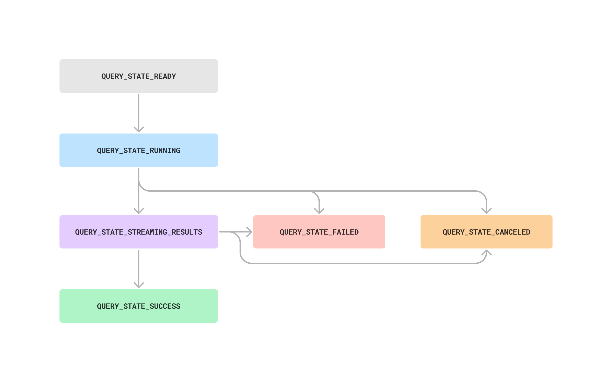

# JSON RPC methods

_**To skip the walkthrough and go straight to dedicated API Documentation,**_ [_**click here**_](https://api-docs.flipsidecrypto.xyz/)_**.**_


Don't see an SDK for your language of choice? Interact directly with the API endpoints below! \
\
Want an SDK for another language, or want to create your own SDK? [Let's talk](https://discord.gg/ZmU3jQuu6W)!&#x20;


Flipside makes available the following SDKs as higher-level, more developer-friendly wrappers over the API. Examples for each SDK are available throughout the [templates-and-walkthroughs.md](get-started/templates-and-walkthroughs.md "mention")

<table><thead><tr><th width="255">Language</th><th width="143">Version</th><th>Source Code (Github)</th></tr></thead><tbody><tr><td>✅ Python</td><td>2.0.7</td><td><a href="https://github.com/FlipsideCrypto/sdk/tree/main/python">Source Code</a></td></tr><tr><td>✅ JS/TypeScript</td><td>2.0.0</td><td><a href="https://github.com/FlipsideCrypto/sdk/tree/main/js">Source Code</a></td></tr><tr><td>✅ R</td><td>0.2.2</td><td><a href="https://github.com/FlipsideCrypto/sdk/tree/main/r/shroomDK">Source Code</a></td></tr></tbody></table>


### Summary

The Query API uses an RPC interface instead of REST for its client-server communication. This is because RPC can provide more efficient communication and support for batch/multi-calls, which is useful for dashboards that have lots of queries powering them. Future functionality will make use of the RPC architecture to enable more efficient/scalable application use cases.

There are three RPC methods you must interact with to execute a query:

1. `createQueryRun`: used to queue up the execution of a query.
2. `getQueryRun`: used to retrieve the status of a query run.
3. `getQueryRunResults`: used to retrieve the results of the query run once it has completed executing.

### Step 1: Create a Query

The following call to the API will queue up the execution of a query. If results already exist the query will not be executed. The endpoint returns a `token` that can be plugged into the `Get Query Results` endpoint to retrieve your data.





```bash
curl --location -g 'https://api-v2.flipsidecrypto.xyz/json-rpc' \
--header 'Content-Type: application/json' \
--header 'x-api-key: {{api_key}}' \
--data '{
    "jsonrpc": "2.0",
    "method": "createQueryRun",
    "params": [
        {
            "resultTTLHours": 1,
            "maxAgeMinutes": 0,
            "sql": "SELECT date_trunc('\''hour'\'', block_timestamp) as hourly_datetime, count(distinct tx_hash) as tx_count from ethereum.core.fact_transactions where block_timestamp >= getdate() - interval'\''1 month'\'' group by 1 order by 1 desc",
            "tags": {
                "source": "postman-demo",
                "env": "test"
            },
            "dataSource": "snowflake-default",
            "dataProvider": "flipside"
        }
    ],
    "id": 1
}'
```



```javascript
var myHeaders = new Headers();
myHeaders.append("Content-Type", "application/json");
myHeaders.append("x-api-key", "{{api_key}}");

var raw = JSON.stringify({
  "jsonrpc": "2.0",
  "method": "createQueryRun",
  "params": [
    {
      "resultTTLHours": 1,
      "maxAgeMinutes": 0,
      "sql": "SELECT date_trunc('hour', block_timestamp) as hourly_datetime, count(distinct tx_hash) as tx_count from ethereum.core.fact_transactions where block_timestamp >= getdate() - interval'1 month' group by 1 order by 1 desc",
      "tags": {
        "source": "postman-demo",
        "env": "test"
      },
      "dataSource": "snowflake-default",
      "dataProvider": "flipside"
    }
  ],
  "id": 1
});

var requestOptions = {
  method: 'POST',
  headers: myHeaders,
  body: raw,
  redirect: 'follow'
};

fetch("https://api-v2.flipsidecrypto.xyz/json-rpc", requestOptions)
  .then(response => response.text())
  .then(result => console.log(result))
  .catch(error => console.log('error', error));
```



```python
import requests
import json

url = "https://api-v2.flipsidecrypto.xyz/json-rpc"

payload = json.dumps({
  "jsonrpc": "2.0",
  "method": "createQueryRun",
  "params": [
    {
      "resultTTLHours": 1,
      "maxAgeMinutes": 0,
      "sql": "SELECT date_trunc('hour', block_timestamp) as hourly_datetime, count(distinct tx_hash) as tx_count from ethereum.core.fact_transactions where block_timestamp >= getdate() - interval'1 month' group by 1 order by 1 desc",
      "tags": {
        "source": "postman-demo",
        "env": "test"
      },
      "dataSource": "snowflake-default",
      "dataProvider": "flipside"
    }
  ],
  "id": 1
})
headers = {
  'Content-Type': 'application/json',
  'x-api-key': '{{api_key}}'
}

response = requests.request("POST", url, headers=headers, data=payload)

print(response.text)

```



<pre class="language-r"><code class="lang-r"><strong>library(shroomDK) # imports jsonlite and httr
</strong>
qtoken &#x3C;- create_query_token(
query = "SELECT * FROM ethereum.core.fact_transactions LIMIT 33",
api_key = readLines("api_key.txt"), #always gitignore your api keys 
ttl = 1,
mam = 5,
data_source = "snowflake-default",
data_provider = "flipside",
api_url = "https://api-v2.flipsidecrypto.xyz/json-rpc"
)

# use body(create_query_token) to see how header and body are formed. 

</code></pre>




### Step 2: Poll for the Status of the Query Run

This endpoint takes as input a query run id returned by the `createQueryRun` rpc call.



```bash
curl --location -g 'https://api-v2.flipsidecrypto.xyz/json-rpc' \
--header 'Content-Type: application/json' \
--header 'x-api-key: {{api_key}}' \
--data '{
    "jsonrpc": "2.0",
    "method": "getQueryRun",
    "params": [
        {
            "queryRunId": "{{queryRunId}}"
        }
    ],
    "id": 1
}'
```



```javascript
var myHeaders = new Headers();
myHeaders.append("Content-Type", "application/json");
myHeaders.append("x-api-key", "{{api_key}}");

var raw = JSON.stringify({
  "jsonrpc": "2.0",
  "method": "getQueryRun",
  "params": [
    {
      "queryRunId": "{{queryRunId}}"
    }
  ],
  "id": 1
});

var requestOptions = {
  method: 'POST',
  headers: myHeaders,
  body: raw,
  redirect: 'follow'
};

fetch("https://api-v2.flipsidecrypto.xyz/json-rpc", requestOptions)
  .then(response => response.text())
  .then(result => console.log(result))
  .catch(error => console.log('error', error));
```



```python
import requests
import json

url = "https://api-v2.flipsidecrypto.xyz/json-rpc"

payload = json.dumps({
  "jsonrpc": "2.0",
  "method": "getQueryRun",
  "params": [
    {
      "queryRunId": "{{queryRunId}}"
    }
  ],
  "id": 1
})
headers = {
  'Content-Type': 'application/json',
  'x-api-key': '{{api_key}}'
}

response = requests.request("POST", url, headers=headers, data=payload)

print(response.text)

```



```r
library(shroomDK) # imports jsonlite and httr
# see above for qtoken <- create_query_token(...)
query_id <- qtoken$result$queryRequest$queryRunId
query_status <- get_query_status(query_id, api_key)

# use body(get_query_status) to see how header and body are formed.
```



Every QueryRun has the following life cycle:

<figure><figcaption></figcaption></figure>

Once the `getQueryRun` has returned a state of `QUERY_STATE_SUCCESS` call the `getQueryRunResults` RPC method to retrieve the result set in Step3.

### Step 3: Get the Query Run Results

This endpoint takes as input a query run id used in the previous two steps.



```bash
curl --location -g 'https://api-v2.flipsidecrypto.xyz/json-rpc' \
--header 'Content-Type: application/json' \
--header 'x-api-key: {{api_key}}' \
--data '{
    "jsonrpc": "2.0",
    "method": "getQueryRunResults",
    "params": [
        {
            "queryRunId": "{{queryRunId}}",
            "format": "csv",
            "page": {
                "number": 1,
                "size": 1
            }
        }
    ],
    "id": 1
}'
```



```javascript
var myHeaders = new Headers();
myHeaders.append("Content-Type", "application/json");
myHeaders.append("x-api-key", "{{api_key}}");

var raw = JSON.stringify({
  "jsonrpc": "2.0",
  "method": "getQueryRunResults",
  "params": [
    {
      "queryRunId": "{{queryRunId}}",
      "format": "csv",
      "page": {
        "number": 1,
        "size": 1
      }
    }
  ],
  "id": 1
});

var requestOptions = {
  method: 'POST',
  headers: myHeaders,
  body: raw,
  redirect: 'follow'
};

fetch("https://api-v2.flipsidecrypto.xyz/json-rpc", requestOptions)
  .then(response => response.text())
  .then(result => console.log(result))
  .catch(error => console.log('error', error));
```



```python
import requests
import json

url = "https://api-v2.flipsidecrypto.xyz/json-rpc"

payload = json.dumps({
  "jsonrpc": "2.0",
  "method": "getQueryRunResults",
  "params": [
    {
      "queryRunId": "{{queryRunId}}",
      "format": "csv",
      "page": {
        "number": 1,
        "size": 1
      }
    }
  ],
  "id": 1
})
headers = {
  'Content-Type': 'application/json',
  'x-api-key': '{{api_key}}'
}

response = requests.request("POST", url, headers=headers, data=payload)

print(response.text)

```



<pre class="language-r"><code class="lang-r">library(shroomDK) # imports jsonlite and httr
# see above for query_status &#x3C;- get_query_status(...)

 query_state &#x3C;- query_status$result$queryRun$state

# this loop is inside get_query_from_token() 

 status_check_done &#x3C;- FALSE
  warn_flag &#x3C;- FALSE

  while (!status_check_done) {

    query_status &#x3C;- get_query_status(
<strong>      query_run_id = query_id, 
</strong>      api_key = api_key, # gitignore your API key 
      api_url = "https://api-v2.flipsidecrypto.xyz/json-rpc"
      ) # default 
    
query_state &#x3C;- query_status$result$queryRun$state

    if(query_state == "QUERY_STATE_SUCCESS"){
      status_check_done &#x3C;- TRUE
      next()
    } else if(query_state == "QUERY_STATE_FAILED"){
      status_check_done &#x3C;- TRUE
      stop(query_status$result$queryRun$errorMessage)
    } else if(query_state == "QUERY_STATE_CANCELED"){
      status_check_done &#x3C;- TRUE
      stop("This query was canceled, typically by cancel_query()")
    } else if(query_state != "QUERY_STATE_SUCCESS"){
      warning("Query in process, checking again in 5 seconds, use cancel_query() if needed.")
      Sys.sleep(5)
    }

  }

</code></pre>




Detailed documentation on Flipside's RPC API can be [found by clicking here](https://api-docs.flipsidecrypto.xyz).

