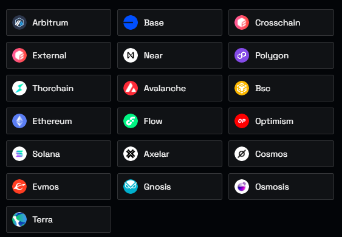

# Pro

Want to build a business or app with blockchain data? Get access to the commercial speed, compute, privacy, and programmatic control you need to scale.

Flipside Pro gives you the entirety of Flipside's on-chain database in a hosted Snowflake server. Flipside covers data storage, so you only pay for computation in a fast **dedicated** warehouse.

**If it happens on-chain, we've got it for 26+ blockchains and protocols:**

<figure><figcaption></figcaption></figure>

_For more details on the schema design see our_ [_data modeling approach_](https://app.gitbook.com/o/-LdEn7uFmFX9w2zbU4Eu/s/-LdEnDLYh6Su5z7LbnEZ/\~/changes/488/data-methodology/data-models)_._

You can try Flipside Pro for 2 weeks completely free at [https://data.flipsidecrypto.com/](https://data.flipsidecrypto.com/)
