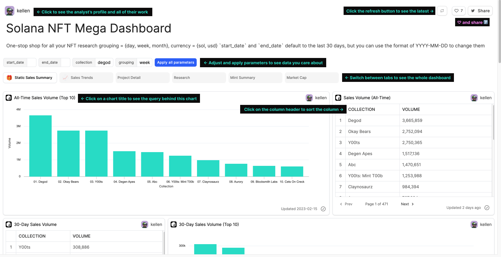

# Get Inspired

This section will cover:

* [How does ranking work on the discover page?](discover.md#ranking-on-the-discover-page)
* [How to find a dashboard I'm interested in?](discover.md#searching-on-the-discover-page)
* [How to find an analyst I know?](discover.md#analyst-view)
* [How to interact with a dashboard?](discover.md#interacting-with-a-dashboard)

***

"Top Dashboards refers to the first dashboards listed on the [discover page](http://flipsidecrypto.xyz). These are the dashboards that fill the landing page, primed for maximum exposure to alpha-seekers.&#x20;

<figure><figcaption>
Top 8 
</figcaption></figure>

Being in the top 8 also increases your ranking as an analyst on Flipside. In fact, the longer your work occupies a Top 8 slot, the higher your ranking climbs.&#x20;

**So, How do you get your work into a Top 8 slot?**

That's a bit of 🧪 a l c h e m y ✨ that will stay a secret. But we can tell you that it's a mix of traffic, likes, and social media engagement — the better your content and the more you share it, the higher chance you have of ranking. Here are a few best practices to raise your chances:

* Focus your dashboard on one relevant, interesting insight. Make it easy for viewers to answer, _"Why is this data important?"_
* Title your board simply and clearly, centered on what a person will learn through it.
* Tweet your board, tagging relevant people for exposure.

***

### Finding things from the Discover page

There are 100K+ dashboards on Flipside 🤯 Here's how to find the ones you're interested in!&#x20;

<figure><figcaption>
Ways to browse dashboards on Flipside. 
</figcaption></figure>

* **Search for a topic:** if you have a topic in mind (like: "impermanent loss osmosis"), type it into the search bar to see all the relevant dashboards.&#x20;
* **Find an analyst:** if you have someone in mind, you can search for them from the ["Analyst View"](discover.md#analyst-view)
* **Focus on a project:** if you have a project you're interested in, simply use the filter on the right-hand side to only see dashboards relevant to that project.&#x20;

***

### Analyst View

To search for an analyst, all you have to do is turn the toggle in the hero section from **"Dashboards"** to **"Analysts"**. Similar to how dashboards are ranked on the Discover page, analysts are also ranked in this view. Analysts closer to the top of the page are those who have created impactful and influential dashboards.&#x20;

From [this view](https://flipsidecrypto.xyz/analysts), you can type an analyst's name into the search bar to find their profile, or explore different analyst profiles by going down the page.&#x20;

<figure><figcaption></figcaption></figure>

Once you find the analyst you're looking for, you can click on their profile to find their top dashboards, and potentially a few ways to get in touch with them. This is a great way to connect with other analysts in the space so make sure you build out your own [profile](broken-reference) too!

<figure><figcaption></figcaption></figure>

***

### Interacting with a dashboard

Now, that you've found a dashboard you're interested in. Let's cover some tips to get the most out of this experience.

<figure><figcaption>
Ways to interact with a Flipside dashboard.
</figcaption></figure>

Here are some ways you can interact with a dashboard:

* **Sort:** sort a result table by clicking on the column header. &#x20;
* **Apply parameters:** if you're viewing a dashboard with parameters available, you can adjust those to see the data you care about. For example, you can set date ranges to narrow in on a time period you're interested in.
* **View a different tab:** Click on the different tabs to see the different "pages" of a dashboard.
* **Check the query:** if you're curious about a query behind a chart, simply click on the chart title to view it.
*   **Fork a query:** build on any query you find interesting by copying it into your workspace.&#x20;

    <figure><figcaption>
Click "Fork" to make a copy of the query. 
</figcaption></figure>
* **Refresh:** Click the 🔁 button on the top right corner to run all the queries powering this dashboard to see the latest information.
* **Like:** if you liked what you saw, hit the ❤️ button — "likes" impact the rankings and you'll help more people see good work by voting for things you enjoy.
* **Share:** found something interesting, share it with your community on Twitter!
