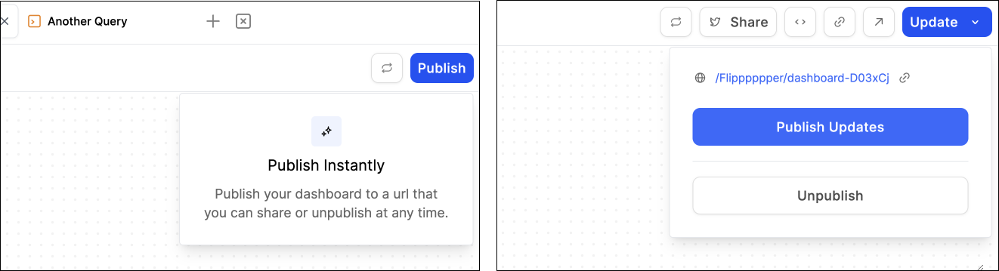

# Build a Dashboard

This section will cover:

* [What can you add to a dashboard?](./#overview-of-dashboard-components)
* [How to add content to a dashboard?](./#building-a-dashboard)
* [How to publish a dashboard?](./#publishing-a-dashboard)

***

### Overview of Dashboard Components

Before we go over how to populate a dashboard, we'll go over the different components of a dashboard. 

<figure><figcaption></figcaption></figure>

In the example dashboard above, we get a glimpse of how different components look on a dashboard. Starting from the top of the screen, and moving down, we see an example of each of the following:

* **Dashboard Title and Description:** be sure to update these! They help people understand what to expect from your dashboards, and make them easier to find on the Discover page.
* **Tabs:** use these as "pages" of a dashboard, that readers can flip through. Analysts often use tabs to organize information by topic.&#x20;
*   **Headings:** are header components that can be styled using the **\[A]** in the top right corner of the header box. You can choose the text color, background, text size, and alignment.&#x20;

    <figure><figcaption>
Heading styles. 
</figcaption></figure>
* **Text boxes:** these are regular text boxes that are best suited for paragraphs. The style of these text boxes can be adjusted using [markdown](https://www.markdownguide.org/basic-syntax/).&#x20;
* **Images:** this helps bring your story to life. You can upload a PNG, SVG, GIF, or JPEG.
* **Charts and Tables:** the star of the show, you can add charts and tables from your queries to the dashboard.&#x20;

***

### **Building A Dashboard**

Now that we have the basics covered, we'll introduce three different ways you can add content to your dashboard.&#x20;

*   **From the query editor:** to add tables and charts from the editor, click the "Add to Dashboard" button in the top right corner of each panel. From there, you can select a dashboard, search for a dashboard, or create a new dashboard.

    <figure><figcaption>
Add tables and charts to a dashboard from the editor. 
</figcaption></figure>
*   **From the action bar:** this is the floating bar at the bottom of the dashboard builder. It is accessible via a dashboard tab that you open in the editor. Click on any component to add a block of that type, or drag any component onto the board directly to add it exactly where you want it to go:

    .png>)
*   **From My Work 😮:** drag and drop any table and chart from My Work directly into your dashboard. Click on the little caret to the left of a query's name to see all the tables and charts associated with it:

    

**Move and Resizing Components**

Once, the components are added to the dashboard, they can be repositioned and resized!

* Reposition a component by dragging and dropping them into blank spaces on the dashboard.&#x20;
* Resize a component by clicking and dragging on the " **⸥** " in the bottom right corner of the container.

***

### Publishing a Dashboard

Once you complete a dashboard, publish it to make it publicly accessible! You can do that by clicking on the "Publish" button in the top right corner of the screen (don't worry this process is irreversible! More on that later). A published dashboard can be accessed by anyone through the Discover page, your analyst profile, and if they have the URL, directly.&#x20;

<figure><figcaption></figcaption></figure>

**Un-publishing / Editing a dashboard**

Don't worry: if you made a mistake in your dashboard, you can easily make changes, then click the the Update button >> Publish Updates to make those changes live.\
\
You can also Unpublish here, which will make your dashboard disappear — people visiting the link will see a 404 error until you publish it again.
