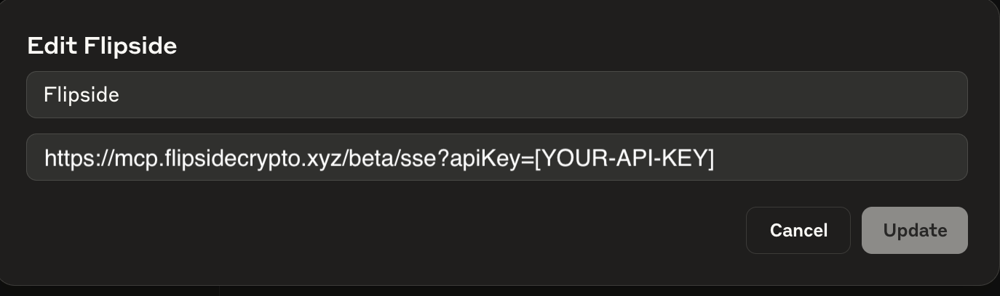

# 🤖 Anthropic Flipside MCP Getting Started Guide


Current supported models:  `claude-sonnet-4` • `gemini/gemini-2.5-pro` • `gemini-2.5-flash-preview-04-17` \
\
For this example we'll be using Anthropic's `claude-sonnet-4` model.&#x20;


#### Requirements before you get started

1. A Claude Pro account
2. A unique Flipside MCP API Key.
   1. Don't have one? [Request one here.](https://flipsidecrypto.xyz/fc/flipside-mcp-interest)

### Quick Setup Instructions

1. Open Claude Settings
   1. Navigate to Settings in your Claude interface
   2. Click on "Integrations" in the left sidebar
2. Access Integration Settings
   1. In the Integrations section, look for the "Add integration" button
   2. Click the "+" Add integration button
3. Add Flipside Integration
   1. Enter "Flipside" as the integration name
   2. Enter the server URL: `https://mcp.flipsidecrypto.xyz/beta/sse?apiKey=[YOUR-API-KEY]`
   3. Click "Update" to save the integration
4. Enable the Integration
   1. Once added, make sure the Flipside integration shows as "Enabled"
   2. The integration should now appear in your list of available integrations

Step 1-2: Settings and Integrations Page&#x20;

<figure><figcaption></figcaption></figure>

Step 3: Adding the Integration&#x20;

<figure><figcaption></figcaption></figure>

Your Flipside MCP server is now ready to use! You can start asking questions about blockchain data and analytics.

Example Analysis: “I want a report on Aptos for the month of may”

<figure><figcaption></figcaption></figure>
